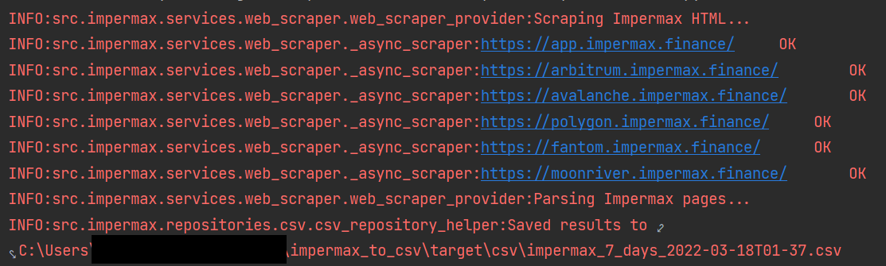
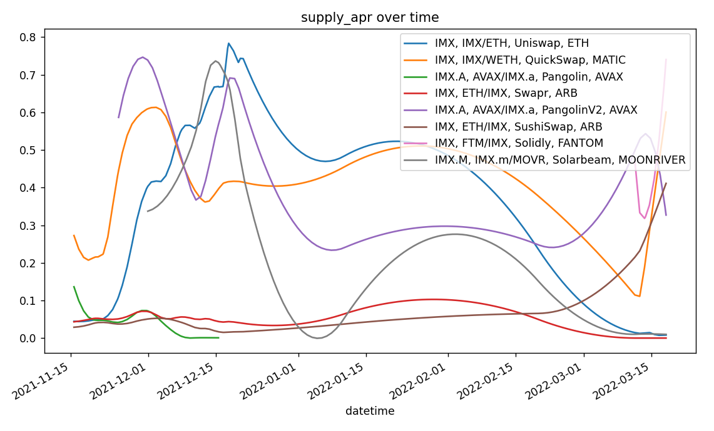

## Effortlessly keep track of 250+ ever-changing APY rates!

This project is **not affiliated with Impermax**, this is not an official release.
___
## Constantly identifying the best APYs on Impermax is a pain.
This tool allows you to effortlessly compare the best APYs over:
- 250+ unique tokens supply and borrow APYs.
- 125+ pairs and their unique leveraged LP APYs.
- 6 blockchains (ETH, MATIC, ARB, AVAX, MOONRIVER, FTM)

## Feature: Fetching live data (7 days average)
Create a python file with the following code, then run it.  
More detailed instructions are provided further down the page.
```python
from src.impermax.impermax_to_csv import main, enable_logging

if __name__ == '__main__':
    enable_logging()
    main()
```
The console output will look something like this.


#### Data location
You may find examples of .CSV files generated by the script in the *./target/csv* directory.  


## Feature: Plotting the supply APR over time.
This little code snippet is all you need to generate a chart of  the specified stablecoin APRs over time.  
It even automatically detects variants such as USDC.e, DAI.e, etc.  
Read more below to see the kind of data you can fetch, and plot.



```python
from src.impermax.repositories.csv.csv_repository import CsvRepository
from src.impermax.plot_aprs import plot

repo = CsvRepository()
r = repo.find_by_tickers('USDC', 'DAI', 'USDT', 'MAI', 'MIM', ...)
plot(repository_data=r)
```

## Bonus Feature: Google Sheets
This is from our dedicated Google Sheets template (linked below).  
You can directly paste the data there!  
Make a copy : https://docs.google.com/spreadsheets/d/13dkbAPx0WSgNpDEDPrNTfrGF_QchMh4M1S5suFsAkO4/

> **Filter used**: Only stablecoins with a supply greater than $100k USD over all available blockchains in descending order.**
> 
>*Comment*: DAI from the USDC/DAI pair on SushiSwap on the MATIC chain has the best supply APR, followed by USDC.e from the USDC.e/USDT.e pair on TraderJoe (Avalanche chain).
>
> 

## Installation requirements:
___
- Python 3.9+ must be installed: https://www.python.org/downloads/release/python-390/
- Git should be installed: https://git-scm.com/downloads

### First time installation instructions
___
Create a new folder, then cd into it with the terminal.  
Then copy-paste these commands.  
(Note for devs: of course, run this in a venv instead.)

```console
  git clone https://github.com/dehidehidehi/impermax_to_csv.git
 ```

```console
  cd impermax_to_csv
  python setup.py install
 ```

### How to retrieve live data from Impermax

Create a new python file with the following contents, this could be on your desktop:  
*start_impermax_to_csv.py*

```python
from src.impermax.impermax_to_csv import main, enable_logging

if __name__ == '__main__':
    enable_logging()
    main()
```

Finally, run the python script:
```commandline
python start_impermax_to_csv.py
```

### Detailed usage of the data plotting feature

```python
from src.impermax.repositories.csv.csv_repository import CsvRepository
from src.impermax.plot_aprs import plot
from src.impermax.common.enums.data_columns_enum import PlottableColumns

# Step 1: specify the data you want.
# This fetches the data from the CSV files created in ./target/*.csv
# You have many ways to retrieve a specific subset of data.
# See all the different methods below.
repo = CsvRepository()


# returns all data
r = repo.find_all()

# returns data for similar tickers, in this case would return data for : IMX, IMX.e, IMX.a, etc.
r = repo.find_by_ticker("IMX")

# returns data for multiple similar tickers.
r = repo.find_by_tickers("IMX", "USDC", ...)

# returns data for IMX pairs only.
r = repo.find_by_ticker_strict("IMX")

# returns data for the IMX and USDC pairs only.
r = repo.find_by_tickers_strict("IMX", "USDC", ...)

# this example returns data for ETHEREUM_IMX_ETH_UNISWAP contract only.
r = repo.find_by_contract("0xa00d47b4b304792eb07b09233467b690db847c91")

# returns data for multiple contract addresses
r = repo.find_by_contracts(
    "0xa00d47b4b304792eb07b09233467b690db847c91",  # ETHEREUM_IMX_ETH_UNISWAP
    "0x8ce3bf56767dd87e87487f3fae63e557b821ea32",  # POLYGON_IMX_WETH_QUICKSWAP
    ...
)

# Step 2: chose what to plot.
# Select from the available options from this enum.
to_plot = PlottableColumns.SUPPLY_APR
to_plot = PlottableColumns.BORROWED_APR
to_plot = PlottableColumns.BORROWED
to_plot = PlottableColumns.SUPPLY


# Step 3: nothing more to do!
plot(repository_data=r, data_to_plot=to_plot)
```

### $$$ Attempting to guilt you into giving me money $$$
___
  

Hi! This tool should save you tons of time and hopefully even more money.  
Tips are appreciated :) 
> **0xCB6c86b53DA5A1316AE6bA773A72bC4D0dB4C021**  
> (ETH Mainnet, Avalanche, and Polygon are my preferred chains ♥)

Let me know your feedback via on Discord (DehiDehi#8605) or Twitter (@dehikupo)!

### Forking and development
___
Any fork or improvement on this app must be open source as well (GPL-3.0 License).
