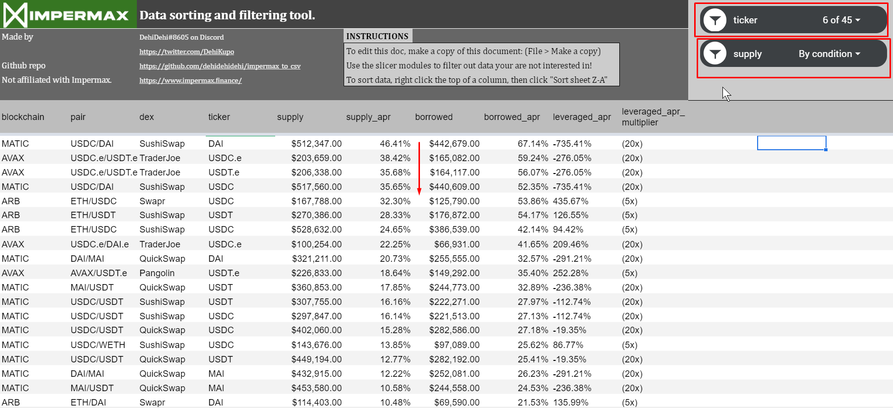

## Effortlessly keep track of 250+ ever-changing APY rates!

This project is **not affiliated with Impermax**, this is not an official release.
___
## Constantly identifying the best APYs on Impermax is a pain.
This tool allows you to effortlessly compare the best APYs over:
- 250+ unique tokens supply and borrow APYs.
- 125+ pairs and their unique leveraged LP APYs.
- 6 blockchains (ETH, MATIC, ARB, AVAX, MOONRIVER, FTM)

### Sample data in the /output folder
You may find examples of .CSV files generated by the script in the ./output directory. I may update it on occasion.

### Example use case: finding the best stable coin to lend.
This is from our dedicated Google Sheets template (linked below). You can directly paste the data there!
> **Filter used**: Only stablecoins with a supply greater than $100k USD over all available blockchains in descending order.**
> 
>*Comment*: DAI from the USDC/DAI pair on SushiSwap on the MATIC chain has the best supply APR, followed by USDC.e from the USDC.e/USDT.e pair on TraderJoe (Avalanche chain).
>
> 

### $$$ Attempting to guilt you into giving me money $$$
___
  

Hi! This tool should save you tons of time and hopefully even more money.
Tips are appreciated :)
0xCB6c86b53DA5A1316AE6bA773A72bC4D0dB4C021
(Eth, Avax, Matic are my preferred chains)

Let me know your feedback via on Discord (DehiDehi#8605) or Twitter (@dehikupo)!

### Installation to run the data fetching script requires:
___
- Some computer knowledge, and knowing how to enter commands in a Windows terminal.
- Works on: Windows 10 and Ubuntu 21. Untested on other distributions.
- Python 3.9 must be installed: https://www.python.org/downloads/release/python-390/
- Does **not work** with Python 3.10.
- Git must be installed: https://git-scm.com/downloads

#### Optional: the Google Sheets template
Paste the data here after it's been generated (see instructions below): https://docs.google.com/spreadsheets/d/13dkbAPx0WSgNpDEDPrNTfrGF_QchMh4M1S5suFsAkO4/

### First time installation instructions
___
Create a new folder, then cd into it with the terminal.
Then copy-paste these commands.

>Note for devs: of course, run this in a venv instead.

```console
  git clone https://github.com/dehidehidehi/impermax_to_csv.git
 ```

```console
  cd impermax_to_csv
  python setup.py install
 ```

### How to retrieve the data

Create a new python file with the following contents, this could be on your desktop:  
*start_impermax_to_csv.py*

```python
from src.impermax.impermax_to_csv import main, enable_logging

if __name__ == '__main__':
    enable_logging()
    main()
```

Finally, run the python script:
```commandline
python start_impermax_to_csv.py
```
The application should show messages, and the save location of the generated CSV file.

### Forking and development
___
Any fork or improvement on this app must be open source as well (GPL-3.0 License).
